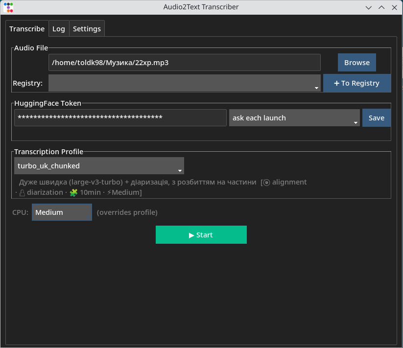
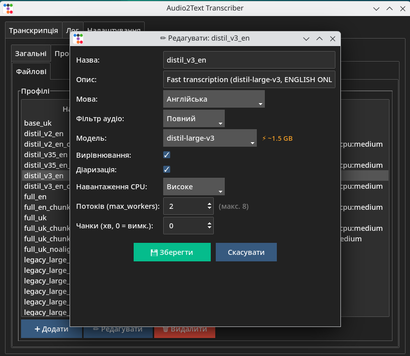
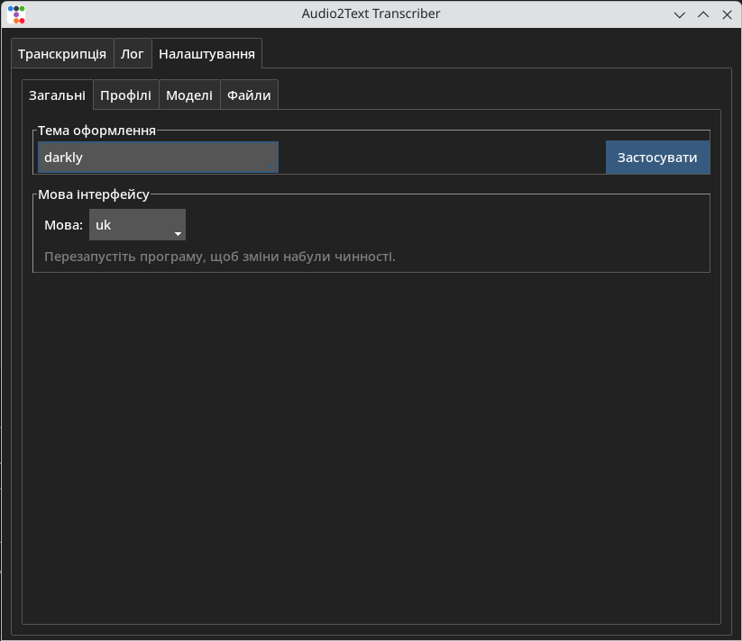
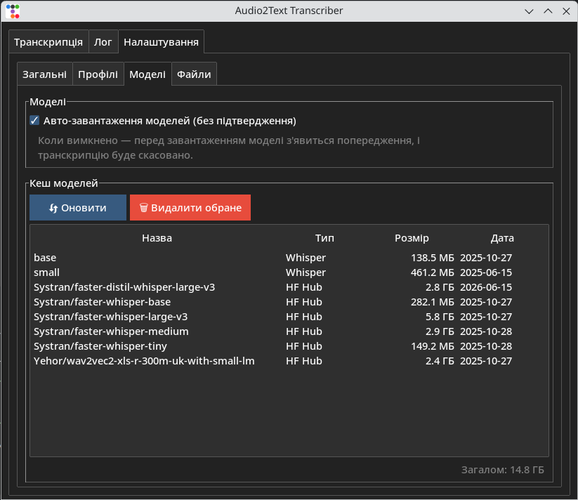

# Audio2Text

[](https://github.com/toldk98/audio2text/releases)
[](LICENSE)
[](https://github.com/toldk98/audio2text/actions)

> **Disclaimer:** This README is auto-translated. The author's native language is Ukrainian.
> For the original version, see [README.md](README.md).

Audio transcription to text using WhisperX with alignment and speaker diarization.
Runs on CPU and NVIDIA GPU.

## Features

**Transcription**
- **WhisperX** — fast transcription with CTranslate2
- **Alignment** — precise timestamps via wav2vec2
- **Diarization** — who speaks when (pyannote.audio)
- **Chunked processing** — parallel processing of long files (10+ hours)
- **Resume** — interrupted transcription can be continued
- **Audio filter** — pre-processing (full / light / off)

**Interface**
- **GUI** — graphical interface (ttkbootstrap) with on-the-fly language switching
- **CLI** — command line
- **Profiles** — saved configuration presets (YAML), create/edit via GUI
- **File Registry** — quick access to external audio files

**Safety & Control**
- **CPU control** — 3 load levels (high/medium/low) with automatic worker cap
- **OOM (out of memory) / DISKOM (disk space)** — RAM and disk checks before launch
- **Token via system keychain** — secure HuggingFace token storage

**Tools**
- **Cache management** — view/delete cached models
- **Audio formats:** M4A, MP3, WAV, OGG (anything ffmpeg can read)

## System Requirements

- **OS:** Windows 10/11 64-bit, Linux (any distribution)
- **Python:** 3.10–3.12 (for manual installation)
- **RAM:** 8 GB minimum (16 GB recommended)
- **Disk:** ~3 GB for models + space for audio files
- **GPU (optional):** NVIDIA with 6+ GB VRAM (CUDA 12.1)

## Installation

### Windows (Portable)

1. Download **Audio2Text-vX.X.X-windows.zip** from [Releases](https://github.com/toldk98/audio2text/releases)
2. Extract to any folder (e.g. `C:\Audio2Text`)
3. Run `install.ps1`:
   - **Do not double-click the file** — it will open in Notepad, not run.
   - Press `Win+R`, type `powershell`, press Enter. In PowerShell, navigate to the extraction folder (`cd C:\Audio2Text`) and run:
     ```
     powershell -ExecutionPolicy Bypass -File install.ps1
     ```
   - Or right-click → "Run with PowerShell" (if available).
4. Launch Audio2Text via **Start Menu** or `audio2text.bat`.

> If the Start Menu shortcut was not created — run `audio2text.bat` directly from the extraction folder.

> If the program does not start — run `audio2text.bat` manually in a terminal and copy the error text.

> **Windows Defender / SmartScreen:** you may see "Windows protected your PC" when downloading or running. Click **"More info"** → **"Run anyway"**. This is a standard warning for unsigned applications.

### Linux (Portable)

1. Download **Audio2Text-vX.X.X-linux.tar.gz** from [Releases](https://github.com/toldk98/audio2text/releases)
2. Extract: `tar -xzf Audio2Text-vX.X.X-linux.tar.gz`
3. Run installer: `cd Audio2Text && bash install.sh`
4. Launch via application menu or command `audio2text`

### Python (Manual, all OS)

```bash
# Python 3.10+
git clone https://github.com/toldk98/audio2text
cd Audio2Text

# Virtual environment
python -m venv venv
source venv/bin/activate   # Linux/macOS
# .\venv\Scripts\activate  # Windows

# System dependencies (Linux)
sudo apt install ffmpeg   # or dnf install ffmpeg / pacman -S ffmpeg

# Python dependencies
pip install torch==2.3.0 torchaudio==2.3.0 --index-url https://download.pytorch.org/whl/cpu
pip install -r requirements.txt
```

> **Important:** Use exactly `torch==2.3.0` / `torchaudio==2.3.0` — newer versions are incompatible with whisperx.

> **GPU:** If you have an NVIDIA GPU with CUDA 12.1, replace `--index-url .../whl/cpu` with `--index-url https://download.pytorch.org/whl/cu121`.

Launch:

```bash
python main.py         # GUI
python main.py file audio.m4a  # CLI
```

## Usage

### GUI
```bash
python main.py
```


*Main window: file selection, profile, start transcription*


*Creating a transcription profile*


*Settings: theme, language*


*Auto-download and cache management*

Tabs:
- **Transcription** — file selection, token, profile, CPU load, run + log
- **Log** — progress and transcription output
- **Settings** — sub-tabs:
  - **General** — theme, interface language (UK/EN)
  - **Profiles** — create/edit/delete profiles
  - **Models** — auto-download models, cache management
  - **Files** — external audio file registry

The result is saved in `~/.cache/audio2text/` as a text file (`.txt`) with recognized text, timestamps, and speaker labels (if diarization is enabled).

### CLI

CLI uses the same token mechanism as GUI: `HF_TOKEN` env var first, then system keychain.

```bash
# Transcribe a file
python main.py file path/to/audio.m4a

# With a profile
python main.py file audio.m4a --profile full_uk

# With model and language selection
python main.py file audio.m4a --model_name large-v3 --language uk

# Split into chunks for parallel processing
python main.py file audio.m4a --chunk_minutes 10 --max_workers 4

# Skip download confirmation prompt
python main.py file audio.m4a -y

# With progress bar
python main.py file audio.m4a --progress

# Toggle alignment and diarization
python main.py file audio.m4a --no-align --diarize

# Audio filter and CPU load
python main.py file audio.m4a --clean_filter light --cpu_profile low

# Interactive picker
python main.py pick

# Cache management
python main.py --list-models
python main.py --delete-model large-v3
```

### Profiles

Profiles are stored in `~/.config/audio2text/profiles.yaml`.
Built-in profiles are copied there on first run.

Profiles can be created and edited via GUI (Settings → Profiles → Add/Edit buttons).
In CLI, use `--profile <name>` to apply a profile — it fills all parameters, and explicit
CLI flags override them.

Example profile:

```yaml
file:
  large-v3:
    full_uk:
      description: "Full transcription (large-v3) + diarization"
      language: uk
      align: true
      diarize: true
```

**Profile fields:**

| Field           | Type | Description                                  |
|-----------------|------|----------------------------------------------|
| `description`   | str  | Description (shown in GUI)                   |
| `language`      | str  | Language code (uk, en, pl, …)                |
| `align`         | bool | Timestamp alignment                          |
| `diarize`       | bool | Speaker diarization                          |
| `model`         | str  | Model size (large-v3, turbo, distil-*, …)    |
| `clean_filter`  | str  | Audio filter: full / light / off             |
| `cpu_profile`   | str  | CPU level: high / medium / low               |
| `max_workers`   | int  | Workers (automatically capped by CPU level)  |
| `chunk_minutes` | int  | Chunk split (0 = disabled)                   |

### HuggingFace Token

Diarization requires a HuggingFace token:

1. Register at [huggingface.co](https://huggingface.co)
2. Accept model terms: [pyannote/speaker-diarization-3.1](https://huggingface.co/pyannote/speaker-diarization-3.1)
3. Create a token: [huggingface.co/settings/tokens](https://huggingface.co/settings/tokens)

The token is stored in the **system keychain** via `keyring`.
Alternatively, set the `HF_TOKEN` environment variable.

#### Linux keychain setup

The system keychain on Linux requires `libsecret`:

```bash
# Debian/Ubuntu
sudo apt install libsecret-tools

# Fedora
sudo dnf install libsecret

# Arch Linux
sudo pacman -S libsecret
```

On Wayland or headless servers (no graphical session), additionally install
the file-based keyring backend:

```bash
pip install keyrings.alt
```

Keys will then be stored in
`~/.local/share/python_keyring/keyrings.alt/file/`.

### External File Registry

Files outside `Audio/` can be added to the registry — they appear in the quick-select
list (GUI: combobox on the transcription tab; CLI: `python main.py pick`).

The registry is stored in `~/.local/share/audio2text/external_registry.json`.

## Interface Language

The GUI supports Ukrainian and English by default.
Switch: **Settings → General → Language** → pick a language → **Apply**.
The language changes immediately, no restart needed.

### Add a new language

Copy a locale file (e.g. `fr.json`) with the same structure as `en.json` into `gui/locales/`.
The combobox will pick it up automatically after a language switch or restart.

The file must contain a `"lang.XX"` key with the language name for the combobox and translations of the required strings:

```json
{
  "lang.fr": "Français",
  "tab.transcribe": "Transcription",
  ...
}
```

## Directory Structure

```
~/.cache/audio2text/          # Transcription working directories
~/.cache/whisper/             # Whisper model cache (.pt)
~/.cache/huggingface/hub/     # CTranslate2/HF model cache
~/.config/audio2text/         # Settings
  ├── profiles.yaml           # Transcription profiles
  └── settings.json           # Theme
~/.local/share/audio2text/    # Data
  ├── Audio/                  # Default audio directory
  └── external_registry.json  # External file registry
```

## Troubleshooting

### Windows — program closes immediately after launch

1. Open **Command Prompt** (`cmd.exe`)
2. Navigate to the Audio2Text folder: `cd C:\path\to\Audio2Text`
3. Run manually: `audio2text.bat`
4. Copy the error text and create an [issue](https://github.com/toldk98/audio2text/issues)

### Linux — "command not found: audio2text"

```bash
# Add ~/.local/bin to PATH:
echo 'export PATH="$HOME/.local/bin:$PATH"' >> ~/.bashrc
source ~/.bashrc
# For Zsh:
echo 'export PATH="$HOME/.local/bin:$PATH"' >> ~/.zshrc
source ~/.zshrc
```

### Linux — USB microphone / recording devices

```bash
# Check input devices:
arecord -l
# If empty, install pavucontrol and configure input:
sudo apt install pavucontrol       # Debian/Ubuntu
sudo dnf install pavucontrol       # Fedora
sudo pacman -S pavucontrol         # Arch
```

### Linux — "No keyring backend available"

```bash
# Install libsecret:
sudo apt install libsecret-tools   # Debian/Ubuntu
sudo dnf install libsecret         # Fedora
sudo pacman -S libsecret           # Arch
# Or file-based backend:
pip install keyrings.alt
```

## License

MIT License — see [LICENSE](LICENSE).

## Credits

- [WhisperX](https://github.com/m-bain/whisperX) — transcription + align + diarization
- [pyannote.audio](https://github.com/pyannote/pyannote-audio) — diarization
- [ttkbootstrap](https://github.com/israel-dryer/ttkbootstrap) — GUI theme
